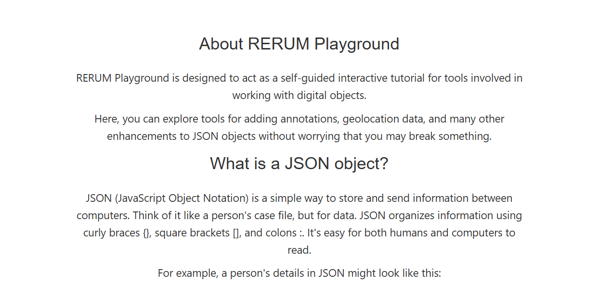
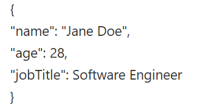

# about.html Documentation
## About the "about.html" File 
This html file presents the about page in the RERUM Playground website explaining what RERUM is about and details of RERUM playground's elements.

## Structure Overview 

**head Container**

- Consists of links to specific JavaScript files for functionality 
and css files for the page aesthetics.

**body Container**

- Consists of elements being displayed on the website.

### Classes

**div class = "header"**
- Represents the top portion of the RERUM about page shown below.

**div class = "content"** 
- Represents the middle portion of the RERUM about page showing what
RERUM Playground is and some of their elements in detail shown below.

**div class = "json"** 
- Represents an example
a description of an object in JSON looks like shown below.

**div class = "spacer"**
- A dedicated empty div element intended to provide necessary vertical spacing at the bottom of the page, ensuring content does not overlap the fixed-position page footer.
footer. However in the about.html documentation, someone commented it is not the correct way. 

### IDs

**div id = "menu-placeholder"**
- Container where only the
menu elements would go.

**div id = "footer-placeholder"** 
- Container where only the
footer elements would go.

### Linked Files

**JavaScript**
- playground.js
- about.js (Not in Repository)

**CSS**
- playground.css
- about.css

## Integration with JavaScript

**function openCloseMenu() function** 
- Triggered when the user clicks
on the three horizontal lines symbol at the header, which opens or closes the menu.

**fetch('footer.html')** 
- Fetches elements belonging to the footer-placeholder ID.

**fetch('menu.html')** 
- Fetches elements belonging to the menu-placeholder ID.
