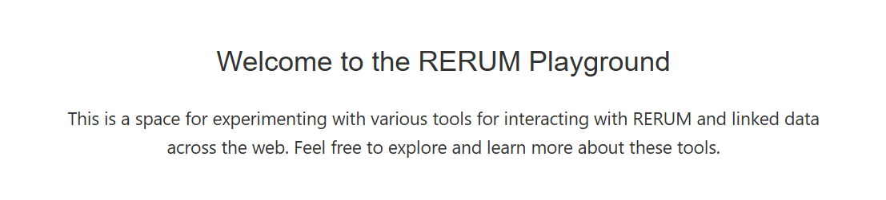

# index.html Documentation
## About the "index.html" File 
This html file is presented as the welcome page of RERUM Playground.
This displays the welcome messages.

## Structure Overview 

**head Container**

- Consists of links to specific JavaScript files for functionality 
and css files for the page aesthetics.

**body Container**

- Consists of elements being displayed on the website.

### Classes

**div class = "header"**
- Represents the top portion of the RERUM about page shown below.

**div class = "container"** 
- Represents the page space between the header and the footer.

**div class = "placeholder"** 
- Represents the spacing between the footer and the welcome
message content.

**div class = "content"** 
- Represents the middle portion of the RERUM about page showing a welcome message shown below.

### IDs

**div id = "menu-placeholder"** 
- container where only the
menu elements would go.

**div id = "footer-placeholder"** 
- container where only the
footer elements would go.

### Linked Files

**JavaScript**
- playground.js
- about.js (Not in Repository)

**CSS**
- playground.css
- about.css

## Integration with JavaScript

**function openCloseMenu() function** 
- Triggered when the user clicks
on the three horizontal lines symbol at the header, which opens or closes the menu.

**fetch('footer.html')** 
- Fetches elements belonging to the footer-placeholder ID.

**fetch('menu.html')** 
- Fetches elements belonging to the menu-placeholder ID.