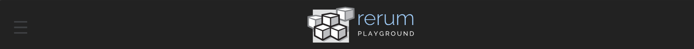
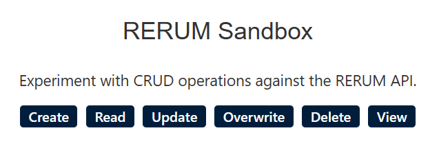
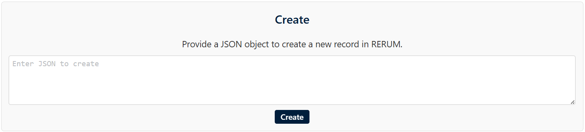
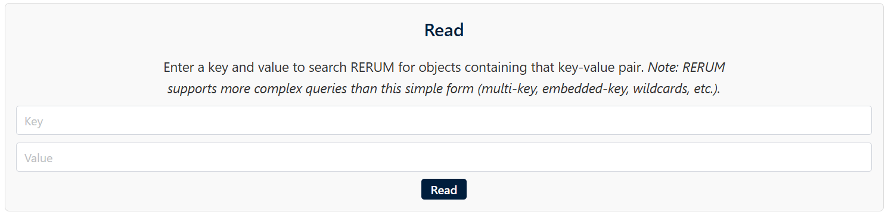
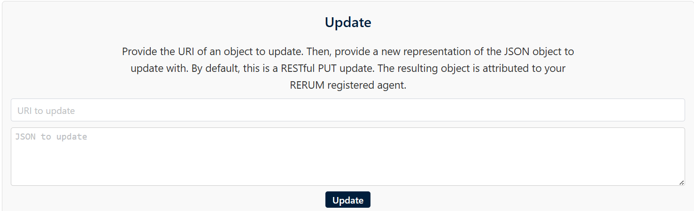
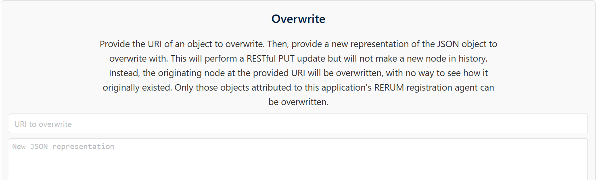
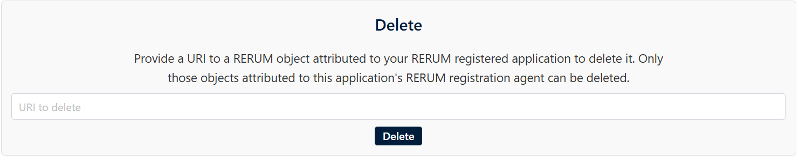
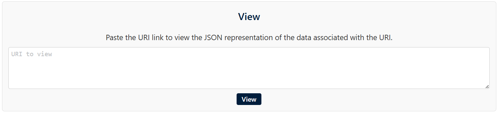

# sandbox.html Documentation
## About the "sandbox.html" File 
This html file presents the sandbox page in the RERUM Playground website where users can experiment with tools used to manipulate and organize RERUM's JSON storage.

## Structure Overview 

**head Container**

- Consists of links to specific JavaScript files for functionality 
and css files for the page aesthetics.

**body Container**

- Consists of elements being displayed on the website.

### Classes

**div class = "header"**
- Represents the top portion of the RERUM about page shown below.

**div class = "content"** 
- Represents the middle portion of the RERUM sandbox page which includes specific buttons to play around with JSON objects.

**div class = "sandbox-buttons"** 

- Represents buttons used to switch into specific modes in RERUM Sandbox.

**div class = "sandbox-sections"**

- Shows sections when a user clicks on a button belonging to "sandbox-buttons".

- For example, when a user clicks on "Create", a container with
elements belonging to the "Create" ID such as a placeholder
to enter a JSON object and a button below the placeholder to create a new JSON object.

**section class = "sandbox-section hidden"**

- A class useful for detecting if a specific section in RERUM sandbox is hidden. 

- For example, the class name would be changed to
"sandbox-section " for a specific ID such as "Create" when a user clicks the Create button. If a user clicks
the create button again, the class name will be changed to"sandbox-section hidden".

### IDs

**div id = "menu-placeholder"**

- Container where only the
menu elements would go.

**div id = "footer-placeholder"** 
- Container where only the
footer elements would go.

**section id = "create"**
- Contains elements used for creating JSON objects shown below:

**section id = "read"**
- Contains elements used for reading JSON objects shown below:

**section id = "update"**
- Contains elements used for updating JSON objects shown below:

**section id = "overwrite"**
- Contains elements used for overwritting JSON objects shown below:

**section id = "delete"**
- Contains elements used for deleting JSON objects shown below:

**section id = "view"**
- Contains elements used for viewing JSON objects shown below:

### Linked Files

**JavaScript**
- playground.js
- sandbox.js

**CSS**
- playground.css
- index.css
- footer.css
- sandbox.css
- https://unpkg.com/chota@latest (external file)
- //maxcdn.bootstrapcdn.com/font-awesome/4.5.0/css/font-awesome.min.css(external file)

## Integration with JavaScript

**function openCloseMenu() function** 
- Triggered when the user clicks
on the three horizontal lines symbol at the header, which opens or closes the menu.

**fetch('footer.html')** 
- Fetches elements belonging to the footer-placeholder ID.

**fetch('menu.html')** 
- Fetches elements belonging to the menu-placeholder ID.

**showSection(id)** 
- Shows a specific section when a user clicks on a button belonging to "sandbox-buttons".