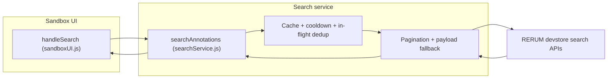

# Annotation search module (contributor guide)

This page explains how annotation text and phrase search works in the RERUM Playground sandbox. It is aimed at contributors who need to debug, extend, or integrate with the feature.

## Architecture overview

Search is implemented entirely in the browser. There is no dedicated backend “search controller” in this repo; orchestration is split between a **UI handler** (sandbox) and a **search service** (HTTP, pagination, caching, normalization).



| Layer | Role | Primary files |
| --- | --- | --- |
| UI | Read query and search type, show loading and errors, render results safely | `web/js/components/sandboxUI.js` |
| Service | Validate input, throttle, cache, call RERUM with pagination, normalize hits | `web/js/services/searchService.js` |
| Configuration | Endpoint URLs and tunables (limits, TTL, cooldown) | `web/js/config.js` |

---

## Search “controller” role (UI + service)

In server frameworks, a *controller* accepts a request and returns a response. Here, the same responsibilities are shared:

1. **`handleSearch` in `sandboxUI.js`**  
   - Reads `#search-query` and `#search-type` (`text` or `phrase`).  
   - Guards against double submission (`isSearchRunning`, disabled button).  
   - Calls `searchAnnotations(query, searchType)`.  
   - Renders status messages, result count, and each result row (ID, body snippet, target, score).  
   - Uses `try` / `finally` so the button is re-enabled even when something throws.

2. **`searchAnnotations` in `searchService.js`**  
   - Validates non-empty query, max length, and `searchType`.  
   - Resolves endpoint URL(s) from `CONFIG.URLS.SEARCH_TEXT` or `CONFIG.URLS.SEARCH_PHRASE`.  
   - Applies cache, in-flight deduplication, and cooldown (see below).  
   - Fetches all pages via `fetchAllPagesWithFallback`, then maps each raw hit through `normalizeHit`.

Together, these two functions are the public “entry points” for understanding search behavior end to end.

---

## Protection layer (UI safety)

The RERUM API returns JSON arrays of annotation objects, but shapes can vary (Web Annotation vs IIIF-style bodies, string vs object `target`, etc.). The service normalizes hits, and the UI adds a second line of defense so bad rows cannot break the page.

**In `searchService.js`**

- **`normalizeHit`** builds a fixed shape: `id`, `annotationId`, `bodyText`, `snippet`, `targetUri`, `score` (from `__rerum.score` when present). It reads `bodyValue`, `body.value`, array `body`, and some `resource` text fields.  
- **`sanitizeHits`** drops non-objects.  
- **`extractHits`** accepts several JSON wrapper shapes (`[]`, `items`, `results`, `hits`, `docs`, `@graph`) so minor API format changes are less likely to crash parsing.

**In `sandboxUI.js`**

- Results are treated as `safeResults = Array.isArray(results) ? results : []`.  
- Each row is coerced with `const r = row && typeof row === "object" ? row : {}`.  
- **Links**: `annotationId` and `targetUri` are only turned into `<a href>` when `isValidUrl` passes; otherwise plain text or an em dash is shown.  
- **Highlighting**: `highlightTerms` uses the DOM (`DocumentFragment`, `mark`) instead of `innerHTML`, so query text cannot inject HTML.

---

## Pagination strategy

RERUM recommends `limit` ≤ 100 per request. The client:

1. Builds a URL with `limit` and `skip` query parameters (see `fetchSearchPage` in `searchService.js`).  
2. Sends **POST** with either JSON (`Content-Type: application/json`) or a plain string body (`text/plain`), depending on which payload shape the server accepts.  
3. After the first page, **`fetchAllPages`** loops: each iteration uses `skip` increased by the number of items returned in the previous page, until a page is empty or **`SEARCH_MAX_PAGES`** (default 50) is reached—whichever comes first.

**Endpoint and payload fallback (`fetchAllPagesWithFallback`)**

- Tries multiple JSON property names for the query (`searchText`, `text`, `query`, and for phrase search also `phrase`), then falls back to a **plain string** body if needed.  
- If the server returns **404** for a URL, the next candidate URL is tried (useful when only one of several possible bases is deployed).

---

## Cache, cooldown, and in-flight reuse

These reduce duplicate work and accidental API hammering (search is expensive on the server).

| Mechanism | Config key(s) | Behavior |
| --- | --- | --- |
| **TTL cache** | `SEARCH_CACHE_TTL_MS` (default 60_000), `SEARCH_CACHE_MAX_ENTRIES` (200) | Key = `searchType::trimmedQuery`. Stores the last normalized `{ error, results }`. Expired entries pruned; map trimmed when over max entries. |
| **Cooldown** | `SEARCH_COOLDOWN_MS` (default 500) | Minimum time between starting new searches (global `lastSearchAt`). |
| **In-flight dedup** | (in-memory `Map`) | Identical key while a request is running returns the same `Promise` so parallel callers share one network sequence. |

Debug logging for the service is gated by `CONFIG.SEARCH_DEBUG`, `?searchDebug=1`, or `localStorage['rerum:search-debug'] === '1'` on localhost (see `isDebugEnabled` in `searchService.js`).

---

## RERUM API integration

Configured URLs (development store) live in `web/js/config.js`:

- **Text search:** `SEARCH_TEXT` → `https://devstore.rerum.io/v1/api/search`  
- **Phrase search:** `SEARCH_PHRASE` → `https://devstore.rerum.io/v1/api/search/phrase`

A concise reference for request/response patterns is in the repo at `docs/RERUMAPIDOC.md` (Text Search and Phrase Search sections). Production hosts differ (`https://store.rerum.io/...`); swap URLs in config if you point the playground at production (mind sandbox data warnings in that doc).

---

## Example API request and response

The playground does not expose a server-side route; the browser calls RERUM directly. Examples below match what `searchService.js` generates (text search, first page).

**Request (JSON body)**

```http
POST https://devstore.rerum.io/v1/api/search?limit=100&skip=0 HTTP/1.1
Content-Type: application/json; charset=utf-8

{"searchText":"medieval manuscript"}
```

**Request (plain string body, fallback)**

```http
POST https://devstore.rerum.io/v1/api/search?limit=100&skip=0 HTTP/1.1
Content-Type: text/plain; charset=utf-8

medieval manuscript
```

**Illustrative JSON response** (array of annotations; fields vary by record)

```json
[
  {
    "@id": "https://devstore.rerum.io/v1/id/abcdef1234567890",
    "body": {
      "value": "This discusses a medieval manuscript fragment."
    },
    "target": "https://example.org/manifest/canvas/1",
    "__rerum": {
      "score": 12.34
    }
  }
]
```

After normalization, the UI consumes objects like:

```json
{
  "id": "https://devstore.rerum.io/v1/id/abcdef1234567890",
  "annotationId": "https://devstore.rerum.io/v1/id/abcdef1234567890",
  "bodyText": "This discusses a medieval manuscript fragment.",
  "snippet": "This discusses a medieval manuscript fragment.",
  "targetUri": "https://example.org/manifest/canvas/1",
  "score": 12.34
}
```

---

## How to extend search

Practical extension points:

1. **New search mode or endpoint**  
   - Add URL(s) in `config.js`.  
   - In `searchService.js`, extend `searchAnnotations` (or add a sibling export) to choose URLs and, if needed, new payload shapes in `getPayloadCandidates` / `fetchAllPagesWithFallback`.

2. **Richer result model**  
   - Extend `normalizeHit` to map additional RERUM fields into the normalized object.  
   - Update the result loop in `sandboxUI.js` to render new fields; keep using DOM APIs or trusted escaping for any user- or API-sourced strings.

3. **UI behavior**  
   - Loading state, truncation (`BODY_TRUNCATE_LENGTH`), and highlight rules live in `sandboxUI.js`.  
   - Phrase vs text highlighting differs: phrase uses the full query as one regex; text splits on whitespace and highlights any term (see `highlightTerms`).

4. **Operational tuning**  
   - Adjust `SEARCH_PAGE_LIMIT`, `SEARCH_MAX_PAGES`, `SEARCH_CACHE_TTL_MS`, `SEARCH_COOLDOWN_MS`, and `SEARCH_MAX_QUERY_LENGTH` in `config.js` without changing core logic.

5. **Product requirements**  
   - High-level scope and field-level expectations for “body only” search are summarized in `search-requirements.md` at the repo root (iteration notes).

---

## Related files (quick reference)

| File | Purpose |
| --- | --- |
| `web/js/components/sandboxUI.js` | Search UI: `handleSearch`, safe rendering, highlighting |
| `web/js/services/searchService.js` | API calls, pagination, cache, normalization |
| `web/js/config.js` | Search URLs and limits |
| `web/sandbox.html` | Search form markup and script entry |
| `docs/RERUMAPIDOC.md` | RERUM search HTTP details and examples |
| `search-requirements.md` | Iteration 1 search requirements |

For general sandbox setup and docs site workflow, see the root `README.md`.
