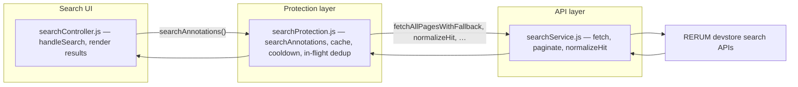

# Annotation search module (contributor guide)

This page matches the **modular search layout** on the `dev_devayani` integration branch: UI lives in `searchController.js`, caching and throttling in `searchProtection.js`, and HTTP/pagination/normalization in `searchService.js`. `sandboxUI.js` only handles generic sandbox section switching and non-search placeholders.

## Architecture overview

Search runs entirely in the browser. There is no server-side “controller”; the roles are split across three modules plus configuration.



| Layer | Role | Primary file |
| --- | --- | --- |
| Sandbox shell | `showSection`, non-search `.action-btn` placeholders | `web/js/components/sandboxUI.js` |
| Search UI | `handleSearch`, loading UI, `highlightTerms`, `isValidUrl`, truncation, `safeResults` | `web/js/components/searchController.js` |
| Protection | Validates query, cache TTL, cooldown, in-flight reuse; calls into service | `web/js/services/searchProtection.js` |
| Search API | POST requests, pagination, payload fallback, `normalizeHit` / `sanitizeHits` / `extractHits` | `web/js/services/searchService.js` |
| Configuration | URLs and limits | `web/js/config.js` |

`web/sandbox.html` loads `sandboxUI.js` and `searchController.js` as separate modules.

---

## Search “controller” role

1. **`handleSearch` in `searchController.js`**  
   Reads `#search-query` and `#search-type`, prevents double submission (`isSearchRunning`, disabled button), calls **`searchAnnotations`** from **`searchProtection.js`** (not from `searchService.js` directly), renders errors and result rows, uses **`BODY_TRUNCATE_LENGTH`**, **`highlightTerms`**, and **`isValidUrl`** for links.

2. **`searchAnnotations` in `searchProtection.js`**  
   Validates input, applies **cache**, **cooldown**, and **in-flight deduplication**, then uses `fetchAllPagesWithFallback`, `sanitizeHits`, and `normalizeHit` from **`searchService.js`** to complete the search.

3. **`searchService.js`**  
   Stateless HTTP + pagination + normalization only (see file header comment). It does **not** own the cache/cooldown logic on this branch.

---

## Protection layer (two parts)

**API normalization (`searchService.js`)**

- **`normalizeHit`** maps a raw RERUM object to `{ id, annotationId, bodyText, targetUri, score }` (display code uses **`bodyText`** for the body column).  
- **`sanitizeHits`** / **`extractHits`** harden parsing against varied JSON shapes.

**Runtime protection (`searchProtection.js`)**

- TTL cache, max entries, cooldown between searches, and reuse of in-flight promises for identical keys.

**UI safety (`searchController.js`)**

- **`safeResults`** guards against non-arrays; each row is coerced to `{}` if needed.  
- Links use **`isValidUrl`** before creating `<a>`.  
- **`highlightTerms`** builds highlights with the DOM (`DocumentFragment` + `<mark>`), not `innerHTML`.

---

## Pagination strategy

Same as before: `limit`/`skip` on POST requests, pages chained until empty or **`SEARCH_MAX_PAGES`**, with endpoint and JSON body-key fallback via `fetchAllPagesWithFallback` in **`searchService.js`**. **`searchProtection`** invokes that flow after passing validation and cache checks.

---

## Cache, cooldown, and in-flight reuse

Implemented in **`searchProtection.js`** with keys from `config.js` (`SEARCH_CACHE_TTL_MS`, `SEARCH_COOLDOWN_MS`, etc.). Debug logging follows the same pattern as described in config (`SEARCH_DEBUG`, `searchDebug=1`, localhost storage toggle).

---

## RERUM API integration

Endpoints are configured in **`web/js/config.js`** (`SEARCH_TEXT`, `SEARCH_PHRASE`). See **`docs/RERUMAPIDOC.md`** for HTTP details. The browser calls RERUM directly; there is no playground backend proxy.

---

## Example API request and response

**Request (JSON body, first page)**

```http
POST https://devstore.rerum.io/v1/api/search?limit=100&skip=0 HTTP/1.1
Content-Type: application/json; charset=utf-8

{"searchText":"medieval manuscript"}
```

**Illustrative response** (array of annotations; fields vary)

```json
[
  {
    "@id": "https://devstore.rerum.io/v1/id/abcdef1234567890",
    "body": { "value": "This discusses a medieval manuscript fragment." },
    "target": "https://example.org/manifest/canvas/1",
    "__rerum": { "score": 12.34 }
  }
]
```

Normalized rows used in the UI include **`bodyText`** and **`targetUri`** as produced by **`normalizeHit`**.

---

## How to extend search

- **UI changes** (layout, truncation, keyboard shortcuts): **`searchController.js`**.  
- **Caching / rate limits**: **`searchProtection.js`** and **`config.js`**.  
- **New endpoints or payload shapes**: **`searchService.js`** (`getPayloadCandidates`, `fetchAllPagesWithFallback`) and **`config.js`** URLs.  
- **Sandbox section wiring only**: **`sandboxUI.js`** — do not move search logic back into this file; keep the separation.

---

## Related files

| File | Purpose |
| --- | --- |
| `web/js/components/searchController.js` | Search UI and `handleSearch` |
| `web/js/services/searchProtection.js` | `searchAnnotations`, cache, cooldown |
| `web/js/services/searchService.js` | Fetch, pagination, normalization helpers |
| `web/js/components/sandboxUI.js` | `showSection`, non-search placeholders |
| `web/js/config.js` | Endpoints and search tunables |
| `web/sandbox.html` | Script entry order for sandbox + search |
| `docs/RERUMAPIDOC.md` | RERUM search API reference |
