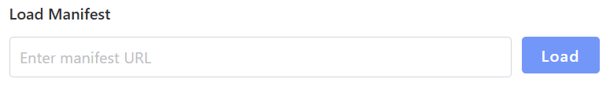
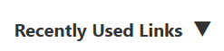

# tools.html Documentation
## About the "tools.html" File 
This html file presents the tools page in the RERUM Playground website showing RERUM Playground's available
tools and loaded manifest.

## Structure Overview 

**head Container**

- Consists of links to specific JavaScript files for functionality 
and css files for the page aesthetics.

**body Container**

- Consists of elements being displayed on the website.

### Classes

**div class = "header"**
- Represents the top portion of the RERUM about page shown below.

**div class = "manifest-loader"** 
- Represents the container class where you enter a manifest URL and click the button to load the URL
as shown below.

**div class = "dropdown"** 
- Represents the dropdown section below the mainfest-loader page section
where you can click the dropdown arrow to see the recently used links.

### IDs

**div id = "tool_set"**

- Container where only the tool elements would go.

**div id = "footer-placeholder"** 
- Container where only the footer elements would go.

### Linked Files

**JavaScript**
- playground.js
- tools.js

**CSS**
- playground.css
- tools.css
- https://unpkg.com/chota@latest (external file)
- //maxcdn.bootstrapcdn.com/font-awesome/4.5.0/css/font-awesome.min.css(external file)

## Integration with JavaScript

**function openCloseMenu() function** 
- Triggered when the user clicks
on the three horizontal lines symbol at the header, which opens or closes the menu.

**fetch('footer.html')** 
- Fetches elements belonging to the footer-placeholder ID.

**fetch('menu.html')** 
- Fetches elements belonging to the menu-placeholder ID.

**document.getElementById('dropdownLabel').addEventListener('click', toggleDropdown); and  document.getElementById('dropdownArrow').addEventListener('click', toggleDropdown);** 
- Triggers a dropdown function to see the recently used links.

**document.addEventListener('DOMContentLoaded')**
- These event listeners ensures the available tools for RERUM Playground are
loaded into the DOM.